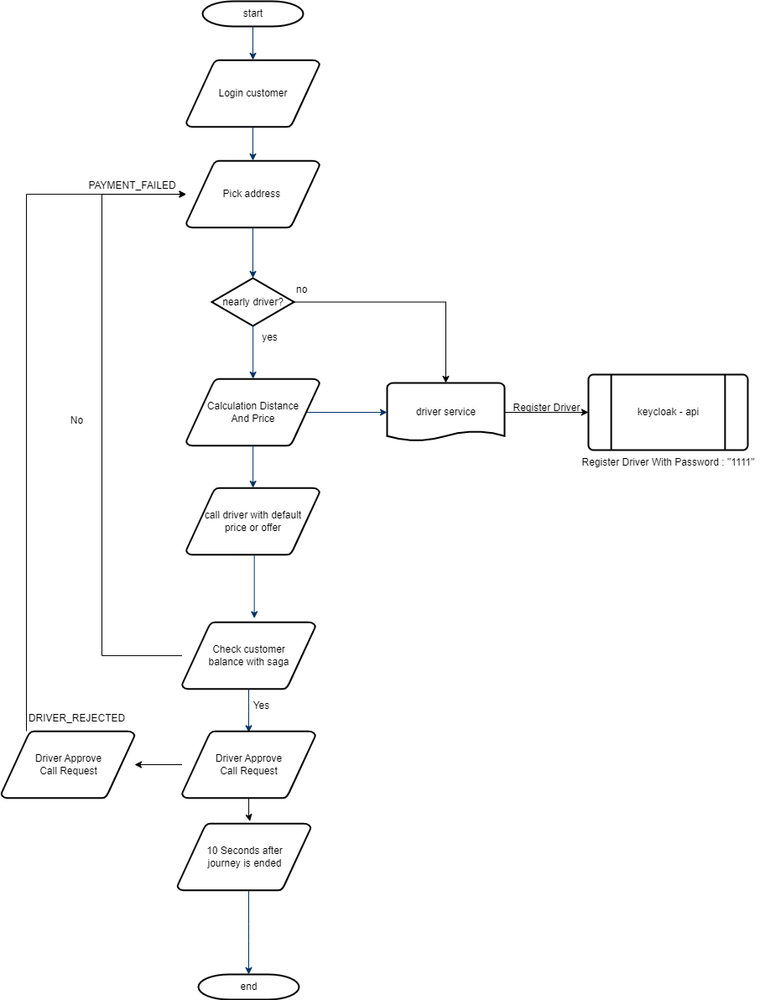

# Uber - App Back-End Challenge

# Status : %90

## Overview

The program allows customers to call and pay for taxis around them according to the locations they choose. 
React was used in the front end of the project created using java language as the back-end.

## Front-End
https://github.com/alicanli1995/uber-api-react-app

## What we are looking for

SAGA Pattern : process & rollback ( compensating transactions )

Outbox Pattern : Pulling Outbox Table With Scheduler , Saga Status

Cover Failure Scenarios :

    Ensure idempotency using outbox table in each service
    
    Prevent concurrency issues with optimistic looks & DB constaints

Keep updating saga and order status for each operation

Relational Database : for ACID and distributed transactional

## Flow

## Technologies

- Java 17
- Spring Boot
- Apache Kafka
- GeoLocation
- WebSocket
- Postgres
- Feign Client
- Keycloak

## Patterns

- Saga
- Outbox
- Layered Architecture
- Microservices
- Event Sourcing

## Services Description

Customer-Api : This service is responsible for the customer's operations.
  - Customer can call taxi 
  - Customer can get own status
  - Customer start can all saga process and rollback process

Driver-Api : This service is responsible for the driver's operations.
  - Driver can accept the call
  - Driver can reject the call
  - Driver can get own status
  - Driver Service list of drivers around the customer

Location-Api : This service is responsible for the location's operations.
  - Location Service generates random locations for customers arrange 10 km radius
  - Get distance between customer and driver
  - Get location of customer and driver by ip address

Payment-Api : This service is responsible for the payment's operations.
  - Payment Service is responsible for payment operations
  - Get customer and driver balance information

Keycloak-Api : This service is responsible for the keycloak's operations.
  - Keycloak Service is responsible for keycloak operations
  - Get token from keycloak
  - Responsible for registering randomly generated drivers
